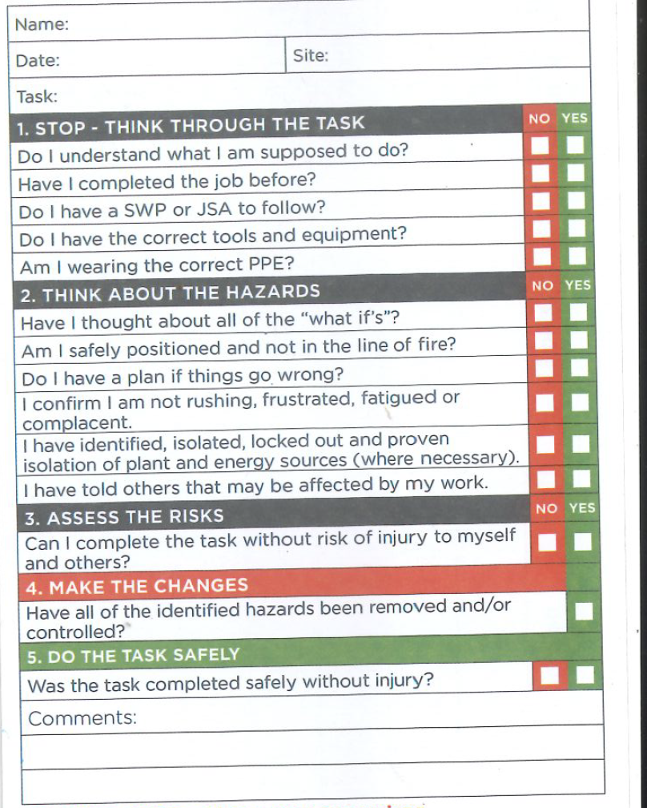
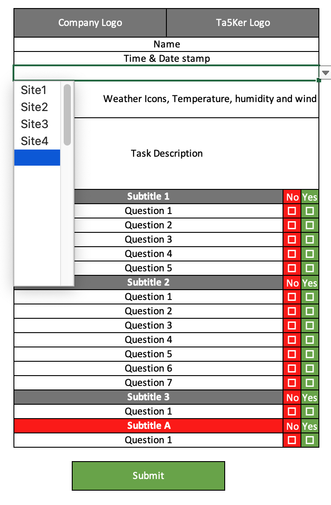

# Project01: Take5

Deployed URL:

GitHub URL: 

## Task
```
Take5 is a process where everyone conduct health and safety checks to mittigate hazards exposure at a task level

```

## User Story

```md
AS AN employer
I WANT an App to complete a Take5 virtually
SO THAT I can comply with my legal Occupational Health Safety and Environment (OHSE) responsibility
```

## Acceptance Criteria

```md
AS AN employee
GIVEN when I start my task, I have to complete my Take5 before I start my task

WHEN I open the Home Page
THEN I enter my name and work site location through the submit button
WHEN I entered my site information
THEN I will be presented with the site temperature, humidity, wind and weather condition (https://openweathermap.org/) and continue button
WHEN I clicked the Take5 button
THEN I am presented with a series of Take5 questions with a Yes/No answer
WHEN I answered YES to everything
THEN I can click the Submit button
WHEN I answer NO to anything
THEN I am presented with a message NOT to proceed with my task and contact my supervisor
WHEN I clicked the Submit button
THEN I am presented with an Inspirational quote (https://type.fit/api/) with a message Stay Safe
```

## Hardcopy of Take5 form



## Wireframe of digital Take5

